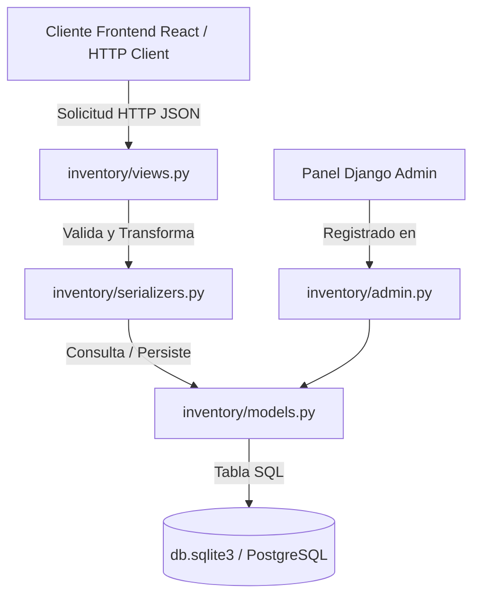
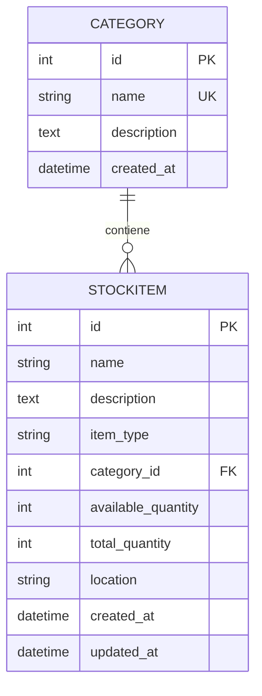

# 📊 Informe Técnico: Módulo de Inventario y Stock (Etapa 2) - CECE App

---

## 🎯 1. Resumen Ejecutivo

El **Módulo de Inventario y Stock** constituye el núcleo de la **Etapa 2** del proyecto **CECE App**. Su objetivo principal es controlar, categorizar y exponer mediante una API REST todos los elementos físicos administrados por el **Centro de Estudiantes de Ciencias Económicas (CECE)**.

El sistema diferencia estructuralmente dos categorías de elementos:
* **Ítems Prestables:** Objetos devueltos por los estudiantes tras su uso (ej. kits de mate, calculadoras científicas, útiles de geometría).
* **Insumos Consumibles:** Materiales entregados de forma definitiva (ej. hojas de estudio, impresiones, servilletas).

---

## 🏗️ 2. Arquitectura de Componentes

La aplicación Django `inventory/` se compone de los siguientes archivos interconectados:

---

## 📘 3. Explicación Detallada por Componente

### 🔹 A. Modelo de Datos ([models.py](file:///home/rch/cece-app/backend/inventory/models.py))

El archivo de modelos define las tablas de la base de datos y la lógica de integridad de datos.

#### 1. Clase `Category`
Representa las familias de productos (ej. *"Tecnología"*, *"Útiles"*, *"Higiene"*).

* **`name`** (`CharField`): Nombre de la categoría. Es único (`unique=True`) para evitar duplicaciones.
* **`description`** (`TextField`): Explicación detallada de los ítems que contiene.
* **`created_at`** (`DateTimeField`): Fecha y hora de creación automática.
* **`Meta`**: Configura los nombres legibles en español (`Categoría` / `Categorías`) y el orden alfabético por defecto.

#### 2. Clase `StockItem`
Representa cada ítem individual dentro del inventario del CECE.

* **`name`** (`CharField`): Nombre identificador del ítem (ej. *"Calculadora Casio fx-95"*).
* **`description`** (`TextField`): Detalles adicionales o estado físico del elemento.
* **`item_type`** (`CharField`): Selección entre `PRESTABLE` y `CONSUMIBLE`.
* **`category`** (`ForeignKey`): Relación N:1 con `Category`. Si la categoría se elimina, se asigna `NULL` (`on_delete=models.SET_NULL`) para no perder la información del ítem.
* **`available_quantity`** (`PositiveIntegerField`): Cantidad de unidades disponibles para préstamo o entrega inmediata.
* **`total_quantity`** (`PositiveIntegerField`): Stock total físico perteneciente al CECE.
* **`location`** (`CharField`): Ubicación física dentro del local (ej. *"Armario 1 - Estante B"*).
* **`created_at` / `updated_at`**: Timestamps automáticos para auditoría y métricas.

#### Validaciones y Métodos del Modelo:
* **`is_available`** (Propiedad): Retorna `True` si `available_quantity > 0`.
* **`clean()`**: Garantiza la regla de negocio fundamental: **el stock disponible nunca puede ser mayor al stock total**. Se ejecuta automáticamente en el método `save()`.

---

### 🔹 B. Serializadores ([serializers.py](file:///home/rch/cece-app/backend/inventory/serializers.py))

Los serializadores convierten los objetos de modelo Django en estructuras **JSON** legibles por el frontend en React y viceversa.

1. **`CategorySerializer`**:
   - Incluye el campo computado `items_count` (cantidad de productos pertenecientes a esa categoría).

2. **`StockItemSerializer`**:
   - Expone la información de la categoría anidada (`category_detail`) y el nombre directo (`category_name`).
   - Incluye la etiqueta traducida del tipo de ítem (`item_type_display` -> *"Prestable"* / *"Consumible"*).
   - Exporta el indicador booleano `is_available`.

---

### 🔹 C. Vistas y API REST ([views.py](file:///home/rch/cece-app/backend/inventory/views.py))

Heredan de `ModelViewSet` de Django REST Framework para proveer automáticamente las 5 operaciones CRUD estándar:
- `GET /api/inventory/items/` (Listar)
- `POST /api/inventory/items/` (Crear)
- `GET /api/inventory/items/{id}/` (Detalle)
- `PUT/PATCH /api/inventory/items/{id}/` (Actualizar)
- `DELETE /api/inventory/items/{id}/` (Eliminar)

#### Filtrado dinámico por Query Parameters:
Se sobreescribió el método `get_queryset()` para permitir filtrado en tiempo real desde React:
* `?item_type=PRESTABLE`: Filtra solo elementos prestables.
* `?category=2`: Filtra por el ID de una categoría específica.
* `?search=calculadora`: Realiza una búsqueda insensible a mayúsculas/minúsculas por el nombre.

---

### 🔹 D. Panel de Administración ([admin.py](file:///home/rch/cece-app/backend/inventory/admin.py))

Configura el backoffice nativo de Django (`/admin/`) para los administradores y personal del CECE:
* Muestra en tabla: ID, Nombre, Tipo, Categoría, Stock Disponible, Stock Total, Ubicación y Estado de Disponibilidad.
* Añade barra de búsqueda por nombre, descripción y ubicación.
* Añade filtros laterales por `item_type` y `category`.

---

### 🔹 E. Pruebas Unitarias ([tests.py](file:///home/rch/cece-app/backend/inventory/tests.py))

Se incluyó una suite automatizada de pruebas para asegurar la calidad del código:
1. **`test_create_stock_item_success`**: Verifica la creación correcta de ítems y el formato de representación `__str__`.
2. **`test_available_quantity_exceeds_total_raises_error`**: Comprueba que la regla de negocio impida stocks disponibles incoherentes.
3. **`test_list_items`**: Prueba la respuesta exitosa (código HTTP 200 OK) al listar elementos en la API REST.
4. **`test_filter_by_item_type`**: Garantiza que el filtro por tipo (`CONSUMIBLE` / `PRESTABLE`) funcione adecuadamente.

---

## 📊 4. Modelo Relacional de la Base de Datos

---

## 🚀 5. Próximos Pasos (Conexión con las Siguientes Etapas)

1. **Etapa 3 (Módulo de Préstamos):**
   - El modelo `Loan` en `loans/models.py` utilizará `StockItem` mediante una `ForeignKey`.
   - Al registrar un préstamo activo, descontará 1 unidad en `available_quantity`. Al devolverse, sumará 1 unidad.
2. **Frontend React (Catálogo de Inventario):**
   - Construir componentes React para consumir los endpoints `/api/inventory/items/` y `/api/inventory/categories/`.

---
*Informe generado para el proyecto CECE App.*
